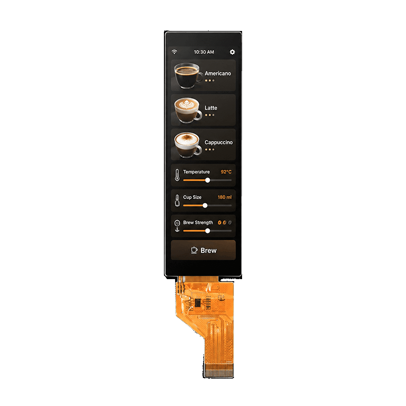

<h1 align="center">OSPTEK 3.48″ TFT 172×640 (AXS15231B · QSPI)</h1>

<b>Bar TFT · QSPI · AXS15231B · Multi-Version Index</b>

English | <a href="./README.md">简体中文</a>

  
  
  
  

## Contents

- [About](#about)
- [Versions](#versions)
- [YDP348BT001-V1](#ydp348bt001-v1)
- [How to Switch Branches](#how-to-switch-branches)
- [Where to Buy](#where-to-buy)
- [Support](#support)

---

## About

This repository holds materials for the **3.48″ 172×640 TFT (QSPI · AXS15231B)** module family.

**`main` is the navigation page** (repository default). Use the table below for a quick scan; click **Details** to jump to the section on this page. For a given version’s full content, switch to that **version branch** (see below).

Repo id: `3.48-tft-172x640-qspi-axs15231b`

---

## Versions

| Version | Image | Notes |
| ------- | ----- | ----- |
| YDP348BT001-V1 |  | [Details](#ydp348bt001-v1) |

---

## YDP348BT001-V1

**Notes:** Module; with touch (AXS15231B).

---

## How to Switch Branches

Full product materials are on each **version branch**; `main` is navigation only.

- **Web:** open the branch dropdown at the top left of the repository page and select the branch that matches your part number.
- **CLI:** after cloning, run `git checkout <version-branch>`; if the repo is already local, `git fetch` first, then switch.

---

## Where to Buy

  
  &nbsp;&nbsp;
  

**International (AliExpress)**

- Store: [OSPTEK Official Store](https://www.aliexpress.com/store/1105701619)

**China (Taobao)**

- Store: [鱼鹰光电工厂店](https://shop110742373.taobao.com/)

---

## Support

- Tech / product: <luyu@osptek.com>
- QQ group: **985881096**
- Website: <https://osptek.com/>
- Feel free to open an Issue in this repository if you have any questions

---

© 2026 OSPTEK · Materials in this repository are licensed under CC BY 4.0

